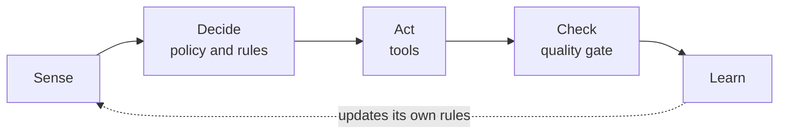
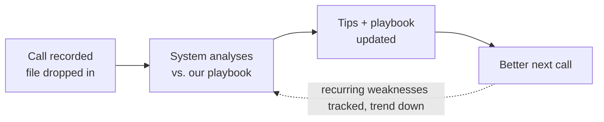

# Company OS — Executive Summary

> **The argument in one breath.** Most companies bolt AI onto the way they already work. We did the opposite: we made AI the **operating layer the company runs on** — a small set of self-correcting loops that capture our own work as it happens, grade it against our standards, and improve without us. The result is a company that gets sharper every week and can be run by a lean team rather than a large one.

*Prepared for [Company Name] leadership · Subject: The Company OS*

---

## i. The shift — from doing the work to capturing it

A traditional organization is an **open loop**: a decision is made, the work is done, and everyone moves on. The lessons live in people's heads and scattered messages, and most are lost.

We treat every important activity as a **closed loop** instead — the work is recorded, measured against a clear standard, and fed back so the process updates itself. One rule governs the rest: *if it isn't recorded, it didn't happen to the system.*

## ii. What we built — an engine kept separate from the fuel

The Company OS is split into two parts we never mix:

- **The OS (the engine)** — repeatable skills, workflows, and the rules for what runs on its own versus what needs a human's sign-off. Plain text, version-controlled, and carries **no company data**.
- **Company data (the fuel)** — calls, metrics, notes. Private, kept where you keep it.

Keeping them apart protects the data *and* makes the operating model **portable**: the engine can be pointed at a different company's fuel without dragging any sensitive information along. Humans sit at the edge — where judgment and relationships live — rather than relaying information up and down a hierarchy.

## iii. Proof point — a coaching loop that runs itself every week

The first live loop is **weekly call coaching**. After a sales or discovery call, the recording is exported as one file (transcript + an external tool's feedback). The system reads it, scores the call against **our own playbook**, and returns specific fixes for the next call. Each run compares against recent calls, so a recurring weakness is flagged and counted rather than quietly repeated.

The measure of success isn't "did it produce tips" — it's whether the **count of recurring weaknesses falls over time**. It runs on a schedule, unattended.

## iv. Why it matters to the business

| | |
|---|---|
| **Leaner by design** | One person plus the system covers work that needed a team. Headcount becomes a choice, not a prerequisite for growth. |
| **Faster decisions** | Removing hand-offs removes delay. Company speed is set by how fast information flows; the loops keep it flowing. |
| **Knowledge compounds** | Expertise is captured as it happens instead of walking out the door. |
| **Portable advantage** | The engine holds no data, so the whole operating model can stand up at another company in days. |

## v. Where this goes next

The same loop, applied function by function — weekly updates, customer calls, KPI monitoring, fundraising prep — each moving up an automation ladder:

1. **Manual** — a person runs the skill by hand to confirm the output.
2. **Assisted** — the system drafts; a person approves anything that leaves the company.
3. **Scheduled** — the loop runs on a fixed cadence without prompting.
4. **Unattended** — it runs in the cloud on schedule, with humans reviewing only exceptions.

> The goal is a company that improves while we sleep, with people spending their time on judgment and relationships rather than relays and rollups.

## vi. Plain-language key terms

- **Closed loop** — a process that records its own results and uses them to improve itself.
- **Skill** — a written, reusable instruction set the system follows to do one job well.
- **Workflow** — a closed loop wired end to end: where input comes from, what's allowed, how it learns.
- **Legible / queryable** — the company's work is captured in a form the system can read and answer questions about.
- **Playbook** — the living record of what good looks like for us, updated automatically.
- **DRI** — directly responsible individual; one named person accountable for an outcome, not a committee.

---

*A polished, visual version of this summary is published via GitHub Pages at <https://smarthgalhotra.github.io/company-os/> (source: `index.html`). Replace bracketed placeholders before distribution.*
